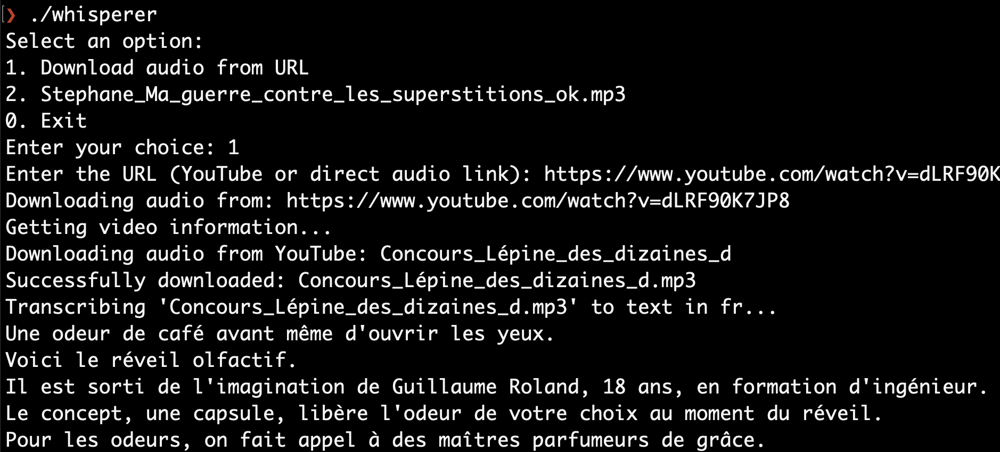

# Whisperer: manage audio transcriptions in your terminal



Lightweight CLI for transcribing audio files using [OpenAI Whisper](https://github.com/openai/whisper) on OS X. It automatically sets up a Python virtual environment, installs Whisper, and generates `.txt` transcripts.

## Folder Structure

```
whisperer/
  ├── app.py          # Main script
  ├── media/          # Audio files
  └── venv/           # Auto-created virtual environment
```

## Features

- Lists audio files in `media/` and lets you choose
- Download audio from URLs (direct audio links or YouTube videos)
- VLC integration - Adds audio to existing VLC playlist or launches new instance (if installed)
- Transcribes using Whisper and saves as `.txt`
- Skips files that are already transcribed
- Automatically creates a Python venv
- Installs Whisper and yt-dlp if not present
- Default language: French (`fr`)

## Requirements

- Python 3.11+ (built and tested with Python 3.13)
- `ffmpeg` installed and available in your system path
- **VLC** (optional) - For automatic audio playback

## Installation (macOS)

1. Install [Homebrew](https://brew.sh)
2. Run:

   ```bash
   brew install python@3.11 ffmpeg
   ```

3. Verify:

   ```bash
   python3 --version
   ffmpeg -version
   ```

4. (Optional) Install VLC for audio playback:

   ```bash
   brew install --cask vlc
   ```

## Dependencies

The app automatically manages its Python dependencies via `requirements.txt`:

- **PyTorch** for CPU inference
- **OpenAI Whisper** for transcription
- **yt-dlp** for YouTube downloads
- **Additional dependencies** (numpy, tiktoken, etc.)

All dependencies are installed automatically when you first run the app.

## How to Run

1. Place your audio files (`.mp3`, `.wav`, `.m4a`, `.flac`, etc.) in the `media/` folder, or use the URL download feature.
2. From terminal:

   ```bash
   cd whisperer
   ./whisperer
   ```

On first run, the script will:
- Create `venv/`
- Install Whisper and yt-dlp
- Show menu with options to download from URL or select existing files
- Generate a `.txt` transcript

## Transcript Formatting

By default, transcripts are automatically formatted to improve readability by joining sentence fragments and removing excessive line breaks.

### Unformatted Transcripts

If you want to preserve the original Whisper output without any formatting, you can manually create a `.noformat.txt` file:

1. After transcription, rename the generated `.txt` file to `.noformat.txt`
2. The app will detect this file and display the transcript without any formatting changes
3. This is useful for song lyrics or other content where you want to preserve the original line structure

### Speaker Detection

The app automatically detects and separates different speakers in conversations:

1. Speaker detection is enabled by default for all transcriptions
2. Each speaker's content appears on a new line
3. No blank lines or speaker labels - just clean line separation

**Example:**
```
media/
├── conversation.mp3
├── conversation.txt          # Speaker-separated transcript
└── conversation.noformat.txt # Unformatted transcript (manually created)
```

**Speaker-separated output example:**
```
l'acétamipride
pour trois ans,
ils voyaient un peu d'espoir
par rapport à leurs concurrents
```

**File Priority:**
1. `.noformat.txt` (if manually created)
2. `.txt` (speaker-separated transcript)

**Speaker Detection Logic:**
- Detects speaker changes based on line breaks, questions, and common phrases
- Works best with clear conversation patterns
- For more accurate detection, consider using dedicated speaker diarization tools

## URL Download Feature

The app supports downloading audio from URLs:

### Direct Audio Links
- Supports direct links to audio files (`.mp3`, `.wav`, `.m4a`, `.flac`, etc.)
- Downloads the file directly to the `media/` folder
- Automatically generates filenames if none are provided

### YouTube Videos
- Supports YouTube URLs (youtube.com, youtu.be, etc.)
- Uses yt-dlp to extract audio tracks
- Converts to MP3 format for optimal compatibility
- Downloads to the `media/` folder with timestamped filenames

### Usage
1. Run the app: `./whisperer`
2. Select option "1. Download audio from URL"
3. Enter the URL (YouTube or direct audio link)
4. The file will be downloaded, automatically added to VLC playlist (or launched if not running), and transcribed

## Changing the Language

1. Run the app: `./whisperer`
2. Select option "2. Change language (currently 'fr')"
3. Choose from the available languages:
   - `fr` (French) - default
   - `en` (English)
   - `it` (Italian)
   - `de` (German)
4. Your selection is automatically saved to `settings.json` (not tracked by `git`)

Your language choice is saved in `settings.json`

## Troubleshooting

### `ffmpeg not found`

Install via Homebrew:

```bash
brew install ffmpeg
```

### Performance

The app uses CPU for transcription, which provides reliable and consistent performance across all systems. While GPU acceleration would be faster, the current CPU implementation ensures maximum compatibility and stability.

**Note:** The warning about FP16/FP32 is normal and expected when using CPU.

### Python Version Compatibility

The app now supports Python 3.11+ and has been tested with Python 3.13.

### YouTube download issues

If YouTube downloads fail:
1. Check your internet connection
2. Verify the YouTube URL is valid and accessible
3. Check the logs in `logs/whisperer.log` for detailed error messages
4. Some videos may be restricted or unavailable in your region

### Direct URL download issues

If direct audio downloads fail:
1. Verify the URL is accessible and points to an audio file
2. Check that the server allows direct downloads
3. Ensure the file format is supported (`.mp3`, `.wav`, `.m4a`, `.flac`)

## Running Tests

```bash
# Run all tests
python tests/runners/tests.py
```

## License

MIT
